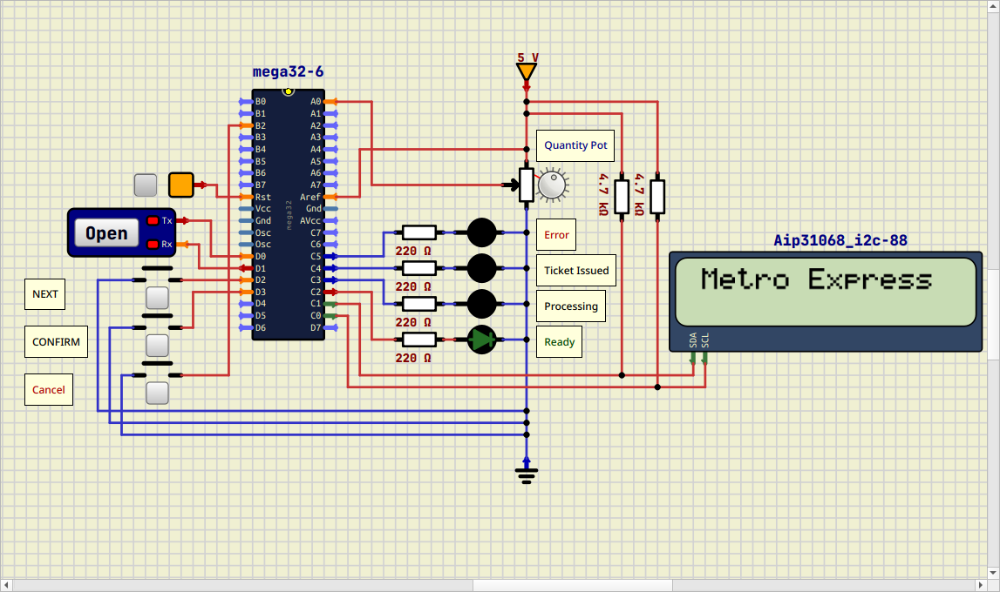

# MetroExpress Ticket Machine

<p align="center">
  
</p>

MetroExpress is a modular embedded firmware project developed for the **Digital Egypt Cubs Initiative (DECI) – Embedded Systems Level 5**. It simulates a self-service railway ticket machine running on an **ATmega32** microcontroller using **SimulIDE**.

The application is built on top of the provided MCAL drivers and follows a finite state machine (FSM) architecture with separate modules for application control, passenger interaction, and event logging.

## Features

- Modular firmware architecture (App, Controller, Passenger, Logger)
- Finite State Machine (FSM) implementation
- Destination selection with LEDs
- Ticket quantity selection using ADC
- UART maintenance logging (9600 baud, 8N1)
- Emergency cancellation using external interrupts
- Inactivity timeout using hardware timers
- SimulIDE simulation support
- CMake-based build system

---

## License

This project was developed as part of the **Digital Egypt Cubs Initiative (DECI)** educational program and is intended for learning and demonstration purposes.

---

## Getting Started

### Clone the Repository

```bash
git clone --depth 1 https://github.com/Sief-Ali/metro-express.git
cd metro-express
```

If you already have the repository and want the latest changes:

```bash
git pull origin main
```

---

## Prerequisites

Install the following tools before building:

- AVR-GCC Toolchain
- CMake
- SimulIDE

---

## Building the Project

Configure the project:

```bash
cmake \
    -B build \
    -DCMAKE_TOOLCHAIN_FILE=cmake/toolchains/avr-gcc.cmake
```

Build the firmware:

```bash
cmake --build build
```

The generated firmware will be located at:

```text
build/src/metro-express.hex
```

---

## Running the Simulation

1. Launch **SimulIDE**.
2. Open the project:

```text
.simulide/main-v1.sim1
```

3. Load the generated firmware:

```text
build/src/metro-express.hex
```

4. Start the simulation.

---

## Project Structure

```text
.
├── src/
│   ├── app/
│   ├── board/
│   ├── hal/
│   ├── mcal/
│   └── utils/
├── cmake/
├── docs/
├── .simulide/
└── CMakeLists.txt
```
